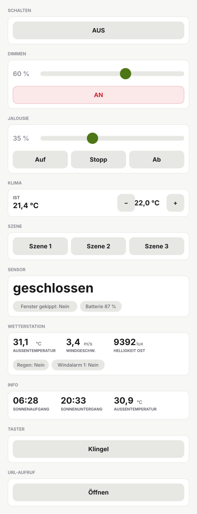

# REGOvisu

Symcon-Kacheln im Design von **REGObaseX1** — dieselben Bedienelemente,
dieselbe Palette, nur auf Symcon-Variablen statt auf einem Gira X1.

Jede Kachel ist eine eigene Instanz, die auf vorhandene Symcon-Variablen zeigt.
Das Modul legt keine eigenen Variablen an und schreibt nichts, was nicht über
einen Knopf ausgelöst wurde — es ist reine Darstellung und Bedienung.

Der Funktionsname steht bewusst **nicht** in der Kachel: die
Kachel-Visualisierung schreibt den Instanznamen selbst darüber.

<picture>
  <source media="(prefers-color-scheme: dark)" srcset="docs/kacheln-dunkel.svg">
  
</picture>

Maßstabsgetreu gezeichnet, hell und dunkel — welche Palette eine Kachel nimmt,
entscheidet sie selbst (siehe [Design](#design)). Zum Anfassen liegt dieselbe
Darstellung als Seite bei: [`docs/vorschau.html`](docs/vorschau.html) — im
Browser öffnen, die Regler und Knöpfe reagieren.

## Module

| Modul | In der Kachel |
|---|---|
| REGOvisu Schalten | AN/AUS-Knopf, AN in Rot |
| REGOvisu Dimmen | AN/AUS-Knopf, Prozentregler, Prozentwert |
| REGOvisu Jalousie | Position in %, Auf / Stopp / Ab |
| REGOvisu Klima | „Ist 21,5 °C", Stepper − / Soll / + |
| REGOvisu Szene | Ein Knopf je Szene — KNX-Szenennummer oder Symcon-Szene |
| REGOvisu Symcon-Szene | Eine Szene, die ihre Mitglieder selbst kennt: aufrufen und speichern |
| REGOvisu Sensor | Große Zahl mit Einheit, darunter Pillen für zweiten Zustand und Batterie — reine Anzeige |
| REGOvisu Wetterstation | Werteraster mit Beschriftungen, darunter die Ja/Nein-Meldungen als Pillen |
| REGOvisu Info | Datum, Sonnenauf- und -untergang, Außentemperatur — steht auf der Startseite |
| REGOvisu Taster | Ein Knopf, der auslöst — ohne Zustandsanzeige, weil ein Taster keinen hat |
| REGOvisu URL-Aufruf | Ein Knopf, der eine Seite in einem neuen Tab öffnet |
| REGOvisu Zähler | Leistung, Zählerstand und Heute, dahinter die weiteren Messwerte |
| REGOvisu Zeitschaltuhr | Nächste Schaltung mit Ziel, AN/AUS und „Überspringen" |

## Installation

Auf einem leeren Symcon genügt **ein** Skript: `tools/regovisu_deploy.php`.
Es installiert die Modulbibliothek selbst und baut danach alles auf:

1. Modulbibliothek über die Modulverwaltung — fehlt sie, wird sie installiert;
   ist sie da und liegt auf GitHub etwas Neueres, wird sie nachgezogen
2. „Visu &lt;Projekt&gt;" mit Etagen und Räumen
3. den kompletten Adresskatalog des importierten ETS-Projekts unter
   „REGOdeploy > KNX": Haupt- und Mittelgruppen mit ihren ETS-Namen, jede
   Gruppenadresse als eigenes, exakt typisiertes Gerät am KNX Gateway — auch
   die Adressen, die keiner REGOdeploy-Funktion gehören („freie")
4. in jeden Raum die passenden Kacheln, verdrahtet mit den Variablen genau
   dieser Geräte — jede Gruppenadresse existiert damit nur einmal in Symcon
6. eine Infokachel auf der Startseite mit Sonnenauf- und -untergang aus
   Symcons Location-Instanz und der Außentemperatur der Wetterstation
7. Aufzeichnung und Diagramm für alle Messwerte (Sensoren, Wetterstation und
   die Ist-Temperatur der Klimakacheln) über die Archive-Instanz
8. Nur-Lesen für genau diese Messwerte: das KNX-Gerät verliert sein
   Schreibrecht, damit die Visualisierung keine Bedienung anbietet, wo ein
   Sensor nichts entgegennimmt

Etagen, Räume und Kacheln stehen in der Reihenfolge, in der REGOdeploy sie
liefert — nicht nach `sort_order`, das im Projekt fast überall auf 0 steht.

In den Räumen stehen damit nur die Kacheln; alles Technische liegt darunter in
„REGOdeploy".

Erneutes Ausführen ist sicher: Umbenennungen, Umzüge und geänderte Adressen
werden nachgezogen, Objekte zu gelöschten Funktionen landen unter
„REGOdeploy – Verwaist" statt gelöscht zu werden.

### Aus REGOdeploy heraus

Das Skript ist zugleich die Push-Vorlage von REGOdeploy
(`backend/regodeploy/symcon/organizer_script.php`). Die fünf `CHANGE_ME`-Zeilen
am Kopf füllt REGOdeploy beim Übertragen aus — deren Schreibweise darf sich
deshalb nicht ändern. „Skript übertragen" und „Skript ausführen" in REGOdeploy
erledigen damit den kompletten Aufbau.

Ohne REGOdeploy trägt man die fünf Werte von Hand ein; die Gateway-Instanz
findet das Skript notfalls selbst.

## Symcon-Szenen

Die KNX-Szene schickt nur eine Nummer auf den Bus; was sie bewirkt, steht in
den Aktoren. Eine **Symcon-Szene** kennt ihre Mitglieder dagegen selbst — und
die dürfen quer über alle Gewerke liegen: KNX-Licht, Modbus-Sollwert, ein
Merker.

Eine Instanz ist eine Szene. In der Mitgliederliste stehen Variable,
Zielwert, ein Häkchen und eine optionale Verzögerung. Zwei Aktionen, beide
auch aus Ereignissen und Skripten aufrufbar:

| Funktion | Wirkung |
|---|---|
| `RGVSS_Aufrufen($id)` | schreibt die Zielwerte; gibt zurück, wie viele Mitglieder geschrieben wurden |
| `RGVSS_Speichern($id)` | übernimmt den aktuellen Zustand als neue Zielwerte |

Geschrieben wird über die Aktion der Zielvariable, also mit echtem Telegramm;
nur wenn keine hinterlegt ist, wird der Wert direkt gesetzt. „Nur schreiben,
was abweicht" spart Telegramme.

Stehen alle Mitglieder auf ihrem Zielwert, gilt die Szene als **aktiv** und
der Knopf wird in Akzentfarbe hervorgehoben. Fließkommawerte werden dabei mit
Toleranz verglichen — eine Rückmeldung vom Bus trifft den gespeicherten Wert
sonst nie genau.

„Speichern" gibt es bewusst nur in der Instanz, nicht in der Kachel: ein
Fehlgriff in der Visu würde die Szene überschreiben.

Den Zielwert stellt man mit Symcons eigenem Bedienelement ein: die Zeile
öffnen, und der Zielwert richtet sich nach dem Profil der Variable — ein
Schalter mit Aus/An, ein Schieber mit Prozent, eine Auswahl mit den
Beschriftungen des Profils. In der Liste steht er so, wie Symcon ihn überall
zeigt: „An", „75 %", „21,5 °C" statt 1, 75, 21.5. Eigene Profile legt REGOvisu
dafür nicht an; damit die Beschriftungen deutsch ankommen, muss Symcons Sprache
gesetzt sein — das Deploy-Skript setzt sie auf einem frischen Symcon auf
`de_DE`. Ältere Zeilen, in denen noch „Aus" oder „1" als Text steht, bleiben
lesbar.

**Mitglieder aus einem Raum übernehmen:** im Formular einen Raum wählen und
den Knopf drücken — die bedienbaren Variablen aller REGOvisu-Kacheln dieses
Raums landen als Zeilen in der Liste, mit dem aktuellen Zustand als Zielwert.
Übernommen wird nur, was eine Szene sinnvoll setzen kann: Schalten,
Helligkeit, Rollladenposition und Soll-Temperatur. Tastbefehle wie Auf/Ab/
Stopp haben keinen Zustand, Messwerte nehmen nichts entgegen.

Die Szenen-Kachel kann beides ansteuern — steht in einer Zeile eine
Symcon-Szene, wird sie aufgerufen, sonst die KNX-Nummer geschrieben.

## Zeitschaltuhren

Vorbild ist die Zeitschaltuhr von REGObaseX1. Eine Instanz ist eine Uhr, und
eine Uhr ist entweder eine **Tagesuhr** — jeden Tag derselbe Ablauf — oder eine
**Wochenuhr**, bei der jeder Schaltpunkt seine eigenen Wochentage hat.

Ein Schaltpunkt hat eine Zeit und ein Ziel:

| | |
|---|---|
| Zeit | feste Uhrzeit, **Sonnenaufgang** oder **Sonnenuntergang**, jeweils mit Verschiebung in Minuten |
| Ziel | eine Variable, eine REGOvisu-Kachel oder eine Symcon-Szene |
| Zielwert | Symcons eigenes Bedienelement, passend zum Profil — Aus/An, Prozent, Grad |

Zeigt das Ziel auf eine Kachel, ist die Variable gemeint, die sie bedient: bei
Schalten der Schaltbefehl, bei Dimmen die Helligkeit, bei Jalousie die Position,
bei Klima die Soll-Temperatur. Eine Szene braucht keinen Wert, sie wird
aufgerufen.

| Funktion | |
|---|---|
| `RGVZU_NaechsteSchaltung($id)` | „heute 20:18", „morgen 06:30", „Uhr ist aus" |
| `RGVZU_Ausloesen($id, $index)` | schaltet einen Punkt sofort, unabhängig von seiner Zeit |
| `RGVZU_Ueberspringen($id)` | lässt den nächsten Termin einmalig aus; noch einmal aufgerufen, setzt er ihn wieder ein |
| `RGVZU_Planen($id)` | stellt den Wecker neu |

Die Kachel zeigt die nächste Schaltung mit ihrem Ziel und hat zwei Knöpfe: die
Uhr an- und ausschalten, und den nächsten Termin auslassen. Der Zustand der Uhr
ist eine echte Variable — eine Szene kann sie also mitschalten, und der Verlauf
lässt sich aufzeichnen.

Die Sonnenzeiten rechnet die Uhr aus den Koordinaten der Standort-Instanz von
Symcon; eine andere lässt sich im Formular eintragen. Weiter als eine Stunde
plant sie nicht voraus — so wandern Sonnenzeiten, Sommerzeit und Änderungen an
den Punkten von selbst mit. **Verpasste Schaltungen holt sie nicht nach:** was
während eines Neustarts fällig war, ist vorbei. Das ist so gewollt und in der
Vorlage genauso.

## Modbus-Energiezähler

Das Deploy-Skript legt einen Finder-7M-Zähler komplett an: Client Socket,
ModBus Gateway und je Messgröße eine Adress-Instanz, dazu die Kachel, die
Verknüpfungen und die Aufzeichnung. Host, Port, Slave-ID, Abfrageintervall und Raum stehen in REGOdeploy unter
**Symcon > Modbus**; das Skript liest sie von dort.

Der Zähler spricht **Modbus RTU über TCP** — RTU-Rahmen mit CRC über eine
TCP-Verbindung, nicht Modbus TCP. In Symcon heißt das `GatewayMode = 2`. Die
Messwerte kommen als Big-Endian-Floats über Funktionscode 4 (Read Input
Registers); die Registeradresse ist Blockstart + Offset × 2, weil die Offsets
der Register-Map Float-Indizes sind.

Die vollständige Register-Map steht als `FINDER_MESSGROESSEN` im Skript
(Blöcke A–D, rund 50 Messgrößen, transkribiert aus REGObase). Aktiv sind
zunächst zehn: Wirkleistung, Leistungsfaktor, Frequenz, drei Spannungen, drei
Ströme und die Wirkenergie. Nachrüsten ist ein `true` statt `false` in der
Zeile — die Energiezähler rechnet Symcon über den Faktor gleich in kWh um.

## Zuordnung

Nichts daran ist geraten:

| Frage | Quelle |
|---|---|
| Welche Aktion gehört zu welchem Bedienelement? | Funktionenkatalog von REGOdeploy (`/api/funktionenkatalog`) |
| Welche Gruppenadresse steckt dahinter? | Projekt-Export (`/export/symcon-tree`) |
| Welche Symcon-Variable ist das? | Das Katalog-Gerät der Adresse (Ident `regodeploy_ga_1_0_0`), dessen Variable `Value` |
| Welcher Datenpunkttyp? | Bei Adressen einer Funktion der DPT der Funktion, sonst der aus der ETS-Datei |
| Welches Symcon-Modul zu einem DPT? | Zur Laufzeit aus Symcons Modulliste (`KNX DPT <n>`), Dimension ist der Nebentyp |

Adressen, denen die ETS keinen Datenpunkttyp gibt, bekommen kein Gerät — ohne
Typ gäbe es nichts zu erzeugen. Das Skript zählt sie und nennt sie am Ende.

| Funktionstyp | Kachel | Aktionen |
|---|---|---|
| `schalten` | Schalten | Schalten, Status |
| `dimmen` | Dimmen | Schalten, Status, Dimmen absolut, Zustandswert |
| `dimmen` / `rgb` | Dimmen | Allgemein Schalten / Status / Helligkeit (+ Rückmeldung) |
| `jalousie` | Jalousie | Move, Step, Move to Position, Position Feedback |
| `temperatur` | Klima | Ist-Temperatur, Soll-Temperatur |
| `klima` | Klima | Ist-Temperatur, Soll-Temperatur (+ Rückmeldung) |
| `szene` | Szene | Szene |
| `sensor` / `temperatur` | Sensor | Temperatur |
| `sensor` / `feuchte` | Sensor | Feuchte |
| `sensor` / `co2` | Sensor | CO2 Wert |
| `sensor` / `fensterkontakt` | Sensor | Fenster offen/geschlossen, gekippt/geschlossen, Batteriestand |
| `sensor` / `rauchmelder` | Sensor | Rauchmelder ausgelöst, Batteriestand |
| `sensor` / `wassermelder` | Sensor | Wassermelder ausgelöst, Batteriestand |
| `sensor` (andere Unterart) | Sensor | die einzige Adresse der Funktion, wenn es genau eine gibt |
| `wetterstation` | Wetterstation | alle Adressen der Funktion, sortiert; Zahlen ins Raster, Ja/Nein in die Pillen |
| `taster` | Taster | Auslösen |
| `url_aufruf` | URL-Aufruf | keine Gruppenadresse — die Adresse kommt aus dem Feld `url` der Funktion |

Rückmeldungen zeigen auf ihre eigene Adresse: bei „Licht — Ein/Aus" schreibt
die Kachel auf die Schaltadresse und liest den Status von der
Rückmeldeadresse. Mehrteilige DPTs (etwa 18.001 für Szenen, mit Nummer und
Aufrufen/Speichern-Bit) sind in `DPT_TEILE` hinterlegt.

Funktionen ohne Häkchen „für die Visu freigegeben", ohne Gruppenadressen oder
ohne passenden Kacheltyp werden übersprungen und am Ende einzeln mit Begründung genannt.

## Detailseite und Verlauf

Unter jeder Kachel legt das Deploy-Skript Verknüpfungen auf die Variablen an,
mit denen sie verdrahtet ist — beschriftet nach ihrer Rolle („Schalten",
„Position Rückmeldung", „Ist-Temperatur"). Die Detailseite der Kachel zeigt
damit die beteiligten Gruppenadressen, jede mit ihrem eigenen Verlauf. Die
Kachel selbst zeichnet nichts.

Nicht mehr verdrahtete Verknüpfungen entfernt das Skript wieder.

## Design

| Rolle | Hell | Dunkel |
|---|---|---|
| Kachelfläche | `#ffffff` | `#131316` |
| Rahmen | `rgba(0,0,0,.08)` | `rgba(255,255,255,.06)` |
| Text | `#1a1a1c` | `#f2f2f4` |
| Akzent | `#4d7616` | `#b9ff5c` |
| Eingeschaltet | `#cf222e` | `#f85149` |

Hell oder dunkel entscheidet die Kachel selbst: die Kachel-Visualisierung hängt
ihre Farben als Query-Parameter an das iframe, aus der Helligkeit von
`cardcolor` leitet das Modul das Theme ab. Die Kachel folgt damit Symcon und
nicht dem Betriebssystem.

Info- und Zählerkachel folgen dagegen den Dashboard-Karten von REGObase:
kleine Felder mit gedämpftem Etikett oben und Wert darunter, im Raster
nebeneinander. Die Schrift ist etwas größer als dort — in REGObase sitzt die
Karte in einer dichten Seitenspalte, hier steht sie allein in einer Kachel.

Der Zuschnitt der Bedienkacheln folgt dem Detail-Dialog von REGObaseX1: Regler oben über die
volle Breite mit großem runden Griff und Prozentwert rechts, darunter gleich
breite Knöpfe. Einen eigenen Rahmen bringt die Kachel nicht mit — Symcons Karte
ist der Rahmen und liefert Raum und Namen.

Schrift ist Inter mit System-Fallback. Das Skript setzt außerdem die Kachelmaße
im Raster, getrennt je Zielgerät und Ausrichtung (`$KACHEL_MASSE`), und die
Startkategorie der Visualisierung auf den Visu-Ordner des Projekts.

## Voraussetzungen

Symcon ab 7.1 (HTML-SDK), entwickelt und getestet auf 9.1.

## Lizenz

MIT
